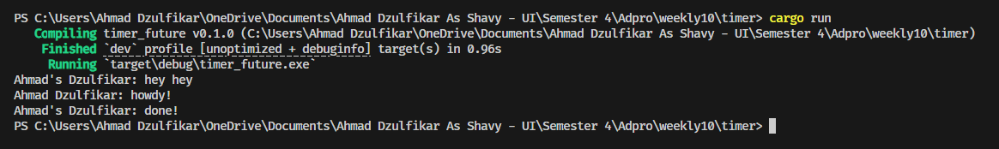
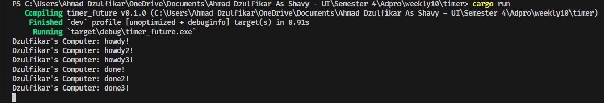

# Tutorial 10 - Timer

## 1.2 Understanding how it works

Ketika kita menjalankan aplikasinya (cargo run) setelah kita menambahkan print diluar spawner.spawn ternyata yang ke print duluan adalah print yang berada di luar spawner.spawn dibandingkan yang di dalamnya meski print tersebut berada dibawah spawner.spawn. Hal ini terjadi karena print yang ke print duluan tersebut berada di luar async block yang menyebabkan print tersebut akan diprint secara duluan. Setelah print yang berada di luar async block terprint maka print yang berada dalam spawner.spawn akan terprint setelah diproses executor.run().

## 1.3 Experiment 1.3: Multiple Spawn and removing drop

Kita menambah 2 spawner baru dan ternyata mereka tereksekusi sesuai dengan urutannya, lalu terprint "done". Setelah semua terprint ternyata ini tidak langsung berhenti, tetapi app terus berjalan yang diakibatkan kita menghapus `drop(spawner)`. Karena '`drop(spawner)` dihapus menyebabkan program untuk tetap berjalan dan statement tersebut berfungsi untuk memberi tahu executor bahwa telah selesai dan tidak akan menerima task lagi nantinya.